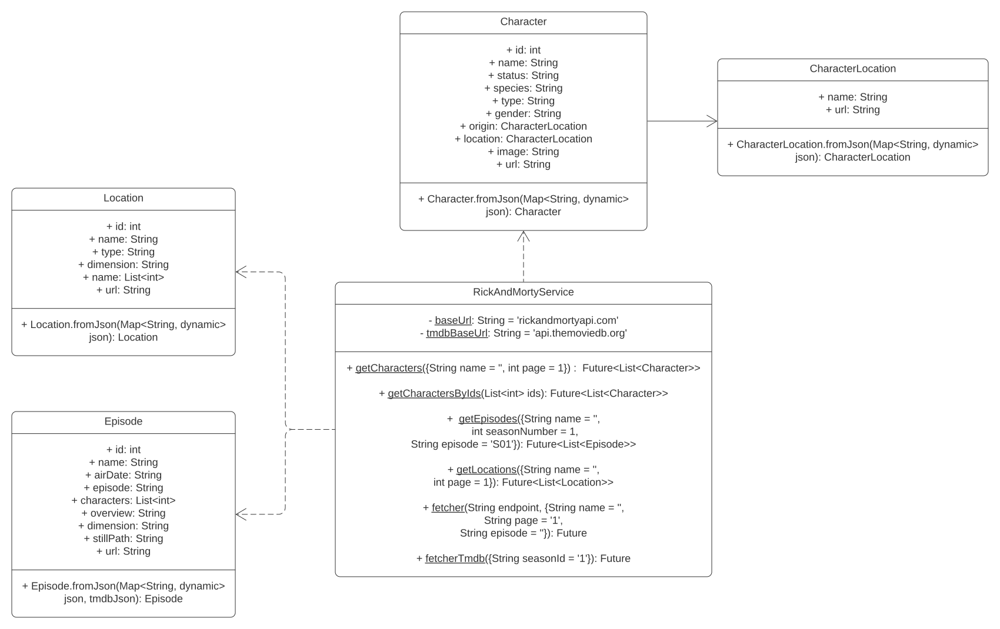

# Rick and Morty 

Rick and Morty Android App which shows characters, episodes, locations of the series. 

Minimun Android version required : **Android 9.0**

Download and unzip

[](https://github.com/escorcia21/RickAndMorty_App/files/9802056/app.zip)

## Getting Started

This repository contains a project that uses the **[Rick and Morty API](https://rickandmortyapi.com/)** and the **[TMDb API](https://www.themoviedb.org/)** to show characters, episodes and locations of the series. The project is written in Flutter and uses the following libraries:

- **[Http](https://pub.dev/packages/http)**: To make HTTP requests.

- **[Google Fonts](https://pub.dev/packages/google_fonts)**: To use Google Fonts.

- **[Envied](https://pub.dev/packages/envied)**: To use environment variables.

- **[Envied_generator](https://pub.dev/packages/envied_generator)**: To generate the environment variables.

## How to Use 

### 1. Clone this repository

```bash
git clone https://github.com/escorcia21/RickAndMorty_App.git
```

### 2. Install dependencies

```bash
flutter pub get
```

### 3. Create a .env file

Create a .env file in the root of the project and add the TMDb API key (previously generated a TMDb account).

```bash
TMDB_KEY=YOUR_API_KEY
```
### 4. Genrate the environment variables

Run the generator that will create the environment variables.

```bash
flutter pub run build_runner build
```

### 5. Run the project

```bash
flutter run --release
```

## Folder Structure

```
lib
├── models
|-- env
├── screens
│   ├── characters
│   ├── episodes
│   ├── locations
│   └── widgets
├── services
├── utils
└── theme
``` 

## Class Diagram



## Mockups


## Screenshots


